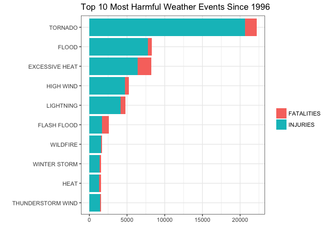
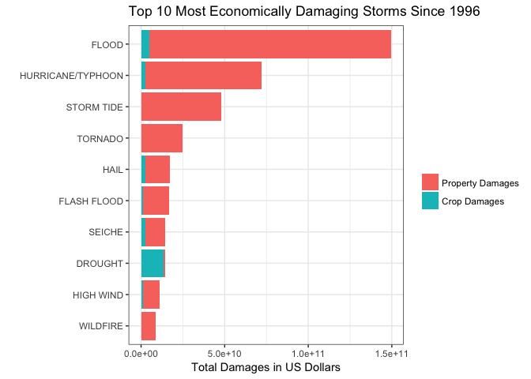

# Tornadoes Hurt the Most People and Floods Hurt the Economy the Most
Emilie Wolf  
July 16, 2017  
## Introduction

Storms and other severe weather events can cause both public health and economic problems for communities and municipalities. Many severe events can result in fatalities, injuries, and property damage, and preventing such outcomes to the extent possible is a key concern.

This project involves exploring the U.S. National Oceanic and Atmospheric Administration's (NOAA) storm database. This database tracks characteristics of major storms and weather events in the United States, including when and where they occur, as well as estimates of any fatalities, injuries, and property damage.

## Data

The data for this assignment comes in the form of a comma-separated-value file compressed via the bzip2 algorithm to reduce its size. You can download the file from the course web site: [Storm Data (47Mb)](https://d396qusza40orc.cloudfront.net/repdata%2Fdata%2FStormData.csv.bz2)

There is also some documentation of the database available. Here you will find how some of the variables are constructed/defined.

National Weather Service [Storm Data Documentation](https://d396qusza40orc.cloudfront.net/repdata%2Fpeer2_doc%2Fpd01016005curr.pdf)

National Climatic Data Center Storm Events [FAQ](https://d396qusza40orc.cloudfront.net/repdata%2Fpeer2_doc%2FNCDC%20Storm%20Events-FAQ%20Page.pdf)

The events in the database start in the year 1950 and end in November 2011. In the earlier years of the database there are generally fewer events recorded, most likely due to a lack of good records. More recent years should be considered more complete.

\  

## Synopsis
***According to my analysis, the data shows that, since 1996, tornadoes are the most harmful to human population health and floods have the greatest economic consequences.***
\  

The dataset from NOAA is mostly complete, but many of the elements are not standardized, especially before 1996. In order to reach my conclusion, I had to subset, manipulate, and clean much of the data. 

\  

## Environment
This analysis was performed using RStudio on a Macbook Pro.

```r
sessionInfo()
```

```
## R version 3.3.2 (2016-10-31)
## Platform: x86_64-apple-darwin13.4.0 (64-bit)
## Running under: OS X El Capitan 10.11.6
## 
## locale:
## [1] en_US.UTF-8/en_US.UTF-8/en_US.UTF-8/C/en_US.UTF-8/en_US.UTF-8
## 
## attached base packages:
## [1] stats     graphics  grDevices utils     datasets  methods   base     
## 
## loaded via a namespace (and not attached):
##  [1] backports_1.0.5 magrittr_1.5    rprojroot_1.2   tools_3.3.2    
##  [5] htmltools_0.3.5 yaml_2.1.14     Rcpp_0.12.9     stringi_1.1.5  
##  [9] rmarkdown_1.6   knitr_1.15.1    stringr_1.2.0   digest_0.6.11  
## [13] evaluate_0.10
```
\  

## Data Processing
First we setup the environment and get the dataframe ready.

```r
## Check for required packages and install if necessary
if (!require("ggplot2")) install.packages("ggplot2")
library(ggplot2)
if (!require("dplyr")) install.packages("dplyr")
library(dplyr)
if (!require("knitr")) install.packages("knitr")
library(knitr)
if (!require("lubridate")) install.packages("lubridate")
library(lubridate)
if (!require("stringdist")) install.packages("stringdist")
library(stringdist)
if (!require("reshape2")) install.packages("reshape2")
library(reshape2)
## Set global plotting theme for ggplot2
theme_set(theme_bw())
```


```r
## Download and import the dataset
stormURL <- "https://d396qusza40orc.cloudfront.net/repdata%2Fdata%2FStormData.csv.bz2"
if(!file.exists("~/StormResearchData")) {dir.create("~/StormResearchData")}
download.file(stormURL, destfile = "~/StormResearchData/stormdata.csv.bz2", method = "curl")
rawstorms <- read.csv("~/StormResearchData/stormdata.csv.bz2", stringsAsFactors = FALSE)
```


```r
## Select only the variables we need for analysis
storms <- select(rawstorms,BGN_DATE,EVTYPE,FATALITIES,INJURIES,PROPDMG,PROPDMGEXP,CROPDMG,CROPDMGEXP)
```


\  

The entered data is skewed before 1996, so let's toss out everything before then.

```r
storms$BGN_DATE <- mdy_hms(storms$BGN_DATE)
storms <- filter(storms, BGN_DATE > "1995-12-31")
```

\  

There are over 900 unique event types in this dataset, so let's clean and narrow it down to 48.

```r
## Change all event types to uppercase so they can be grouped together better
storms$EVTYPE <- toupper(storms$EVTYPE)

## Remove whitespaces (probably not necessary because the next step fixes all the event types)
storms$EVTYPE <- trimws(storms$EVTYPE)

## Create a vector of the 48 official event types
officialev <- c("Astronomical Low Tide","Avalanche","Blizzard","Coastal Flood","Cold/Wind Chill","Debris Flow","Dense Fog","Dense Smoke","Drought","Dust Devil","Dust Storm","Excessive Heat","Extreme Cold/Wind Chill","Flash Flood","Flood","Freezing Fog","Frost/Freeze","Funnel Cloud","Hail","Heat","Heavy Rain","Heavy Snow","High Surf","High Wind","Hurricane/Typhoon","Ice Storm","Lakeshore Flood","Lake-Effect Snow","Lightning","Marine Hail","Marine High Wind","Marine Strong Wind","Marine Thunderstorm Wind","Rip Current","Seiche","Sleet","Storm Tide","Strong Wind","Thunderstorm Wind","Tornado","Tropical Depression","Tropical Storm","Tsunami","Volcanic Ash","Waterspout","Wildfire","Winter Storm","Winter Weather")

## Convert the string vector to uppercase
officialev <- toupper(officialev)

## Make a new column that matches typos and unoffical event types to the official 48 using 'stringdist' package
storms$EVTYPE_48 <- officialev[amatch(storms$EVTYPE,officialev,method="lv", maxDist=20)]
```


\  

## Exploratory Data Analysis

Now let's look around and play with the data.


\  

#### Across the United States, which types of events are most harmful with respect to population health?

For this question, we need to group by event type and summarize injuries and fatalities.


```r
mostharmful <- storms %>% select(EVTYPE_48, FATALITIES, INJURIES) %>% group_by(EVTYPE_48) %>% summarize(FATALITIES = sum(FATALITIES), INJURIES = sum(INJURIES))

# View Top 5
head(arrange(mostharmful,desc(FATALITIES)),5)
```

```
## # A tibble: 5 × 3
##        EVTYPE_48 FATALITIES INJURIES
##            <chr>      <dbl>    <dbl>
## 1 EXCESSIVE HEAT       1797     6393
## 2        TORNADO       1511    20667
## 3    FLASH FLOOD        889     1675
## 4      LIGHTNING        652     4143
## 5    RIP CURRENT        542      503
```

```r
head(arrange(mostharmful,desc(INJURIES)),5)
```

```
## # A tibble: 5 × 3
##        EVTYPE_48 FATALITIES INJURIES
##            <chr>      <dbl>    <dbl>
## 1        TORNADO       1511    20667
## 2          FLOOD        515     7798
## 3 EXCESSIVE HEAT       1797     6393
## 4      HIGH WIND        484     4727
## 5      LIGHTNING        652     4143
```
\  

As can be seen by the output, tornadoes rank #1 in injuries and excessive heat ranks #1 in fatalities.
Let's see what this data looks like combined.


```r
mostharmful$TOTAL <- mostharmful$FATALITIES + mostharmful$INJURIES
head(arrange(mostharmful,desc(TOTAL)),5)
```

```
## # A tibble: 5 × 4
##        EVTYPE_48 FATALITIES INJURIES TOTAL
##            <chr>      <dbl>    <dbl> <dbl>
## 1        TORNADO       1511    20667 22178
## 2          FLOOD        515     7798  8313
## 3 EXCESSIVE HEAT       1797     6393  8190
## 4      HIGH WIND        484     4727  5211
## 5      LIGHTNING        652     4143  4795
```

So, all in all, since 1996, tornadoes are the most harmful to human health.

\  

#### Across the United States, which types of events have the greatest economic consequences?

For this question, we need to group by event and summarize property damage and crop damage. 


```r
## Remove observations with 0 damage
ecodmg <- storms %>% select(-FATALITIES,-INJURIES,-BGN_DATE,-EVTYPE) %>% filter(PROPDMG != 0 | CROPDMG != 0)

## Convert the multipliers to all uppercase
ecodmg$PROPDMGEXP <- toupper(ecodmg$PROPDMGEXP)
ecodmg$CROPDMGEXP <- toupper(ecodmg$CROPDMGEXP)
```


```r
## Let's look at the multipliers
unique(ecodmg$PROPDMGEXP)
```

```
## [1] "K" "M" ""  "B"
```

```r
unique(ecodmg$CROPDMGEXP)
```

```
## [1] "K" ""  "M" "B"
```

We know that "K = 1000, "M" = 1,000,000, "B" = 1,000,000,000, and "" = 1.

```r
ecodmg[ecodmg$PROPDMGEXP == "K",]$PROPDMGEXP = "1000"
ecodmg[ecodmg$PROPDMGEXP == "M",]$PROPDMGEXP = "1000000"
ecodmg[ecodmg$PROPDMGEXP == "B",]$PROPDMGEXP = "1000000000"
ecodmg[ecodmg$PROPDMGEXP == "",]$PROPDMGEXP = "1"

ecodmg[ecodmg$CROPDMGEXP == "K",]$CROPDMGEXP = "1000"
ecodmg[ecodmg$CROPDMGEXP == "M",]$CROPDMGEXP = "1000000"
ecodmg[ecodmg$CROPDMGEXP == "B",]$CROPDMGEXP = "1000000000"
ecodmg[ecodmg$CROPDMGEXP == "",]$CROPDMGEXP = "1"
```
\  
Now let's make new columns showing the actual economic damage

```r
## Change the mulipliers from string to numeric class
ecodmg$PROPDMGEXP <- as.numeric(ecodmg$PROPDMGEXP)
ecodmg$CROPDMGEXP <- as.numeric(ecodmg$CROPDMGEXP)

## Multiply the notation by the exponents
ecodmg$PROPTOTAL <- ecodmg$PROPDMG*ecodmg$PROPDMGEXP
ecodmg$CROPTOTAL <- ecodmg$CROPDMG*ecodmg$CROPDMGEXP
```
\  


```r
## Now we can finally group by event type and summarize
ecodmg <- ecodmg %>% group_by(EVTYPE_48) %>% summarize(PROPTOTAL=sum(PROPTOTAL), CROPTOTAL=sum(CROPTOTAL))

## Make a new column showing combined total damages
ecodmg$TOTALDMG <- ecodmg$PROPTOTAL+ecodmg$CROPTOTAL

## View the top 5
head(arrange(ecodmg,desc(TOTALDMG)),5)
```

```
## # A tibble: 5 × 4
##           EVTYPE_48    PROPTOTAL  CROPTOTAL     TOTALDMG
##               <chr>        <dbl>      <dbl>        <dbl>
## 1             FLOOD 144563771550 4975903400 149539674950
## 2 HURRICANE/TYPHOON  69305840000 2607872800  71913712800
## 3        STORM TIDE  47834874000     855000  47835729000
## 4           TORNADO  24616945710  283425010  24900370720
## 5              HAIL  14596013420 2476279450  17072292870
```

So, there we have it: floods cost the most in crop and property damages combined, about $150Billion since 1996.

\  


## Results
Now we plot some visuals!

```r
## Subset just the top 10 weather events
mostharmful <- head(arrange(mostharmful,desc(TOTAL)),10)

## Remove the total column
mostharmful$TOTAL = NULL

## Now use 'reshape2' package to melt the dataset into long format
mostharmful <- melt(mostharmful, id.var="EVTYPE_48")

## Sort the data 
mostharmful <- within(mostharmful, {
  EVTYPE_48 <- factor(EVTYPE_48, levels = names(sort(tapply(value, EVTYPE_48, sum))))
})

## Make it pretty!
plot1 <- ggplot(mostharmful, aes(x = EVTYPE_48, y = value, fill = variable)) + 
        geom_bar(stat = "identity") +
        coord_flip() + ggtitle("Top 10 Most Harmful Weather Events Since 1996") + 
        xlab("") + ylab("") + labs(fill="")
plot1
```

<!-- -->


```r
## Subset the top 10 weather events
ecodmg <- head(arrange(ecodmg,desc(TOTALDMG)),10)

## Remove the total column
ecodmg$TOTALDMG = NULL

## Now use 'reshape2' package to melt the dataset into long format
ecodmg <- melt(ecodmg, id.var="EVTYPE_48")

## Sort the data 
ecodmg <- within(ecodmg, {
  EVTYPE_48 <- factor(EVTYPE_48, levels = names(sort(tapply(value, EVTYPE_48, sum))))
})

## Make it pretty!
plot2 <- ggplot(ecodmg, aes(x = EVTYPE_48, y = value, fill = variable)) + 
        geom_bar(stat = "identity") +
        coord_flip() + ggtitle("Top 10 Most Economically Damaging Storms Since 1996") + 
        xlab("") + ylab("Total Damages in US Dollars") + labs(fill="") +
        scale_fill_discrete(labels = c("Property Damages", "Crop Damages"))
plot2
```

<!-- -->

\  

Thank you for reviewing my storm research!
